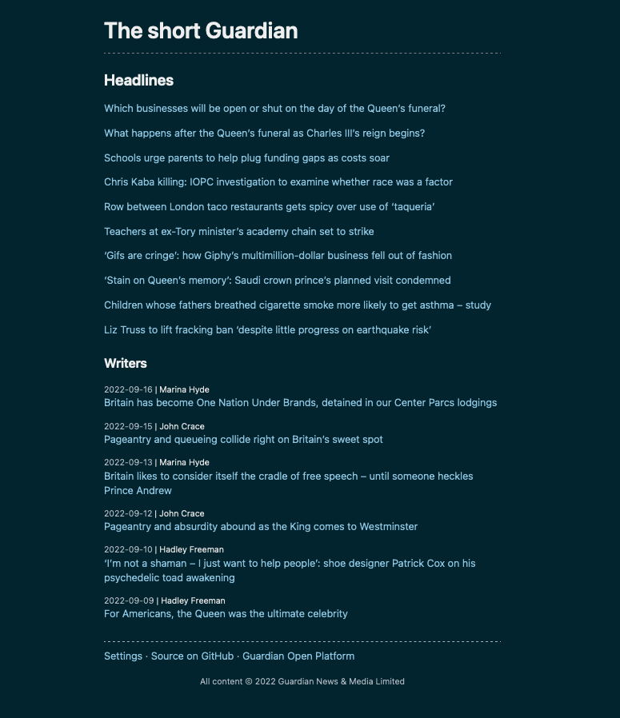
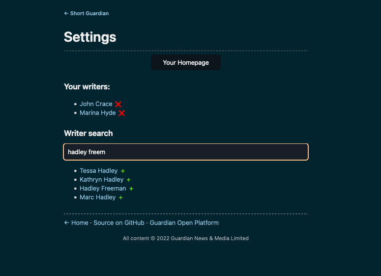
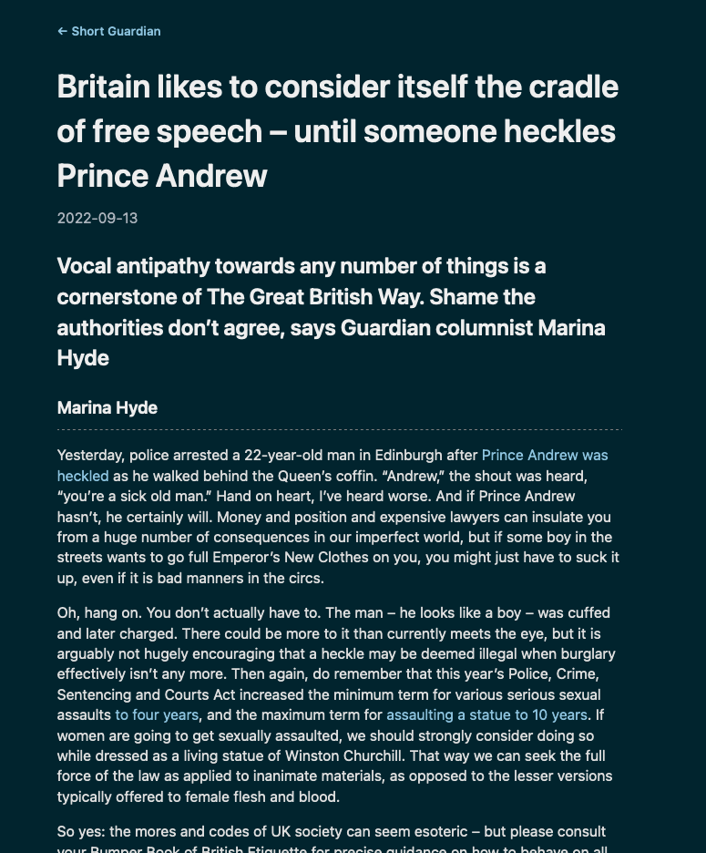

# The short Guardian

Text only news from [The Guardian](https://www.theguardian.com), displaying the current headlines plus the most recent articles from a customizable list of writers. Data is provided by the [Open Platform](https://open-platform.theguardian.com/).

This is an example project for serving html from [scalatags](https://github.com/com-lihaoyi/scalatags) with interactivity provided by [htmx](https://htmx.org/).

